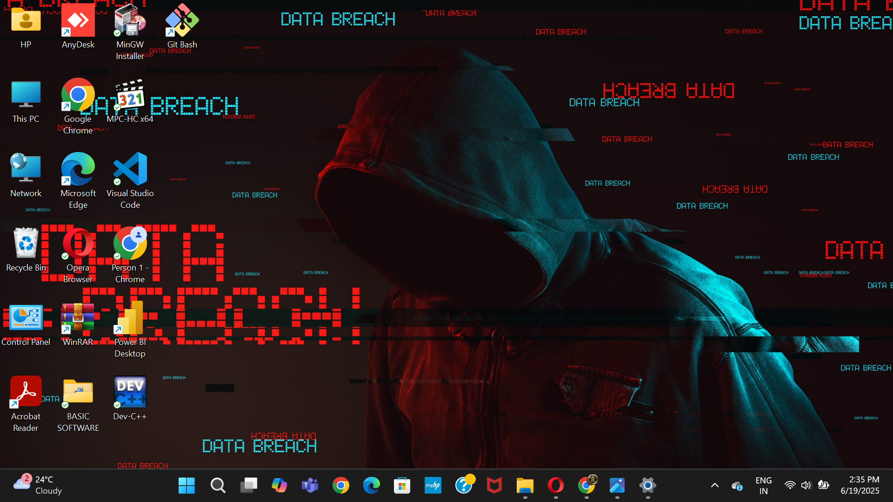

# LeetMetric

LeetMetric is a web application that allows users to analyze any public LeetCode profile in real time. It retrieves coding statistics from a public LeetCode API and presents them through an interactive dashboard with difficulty-wise progress indicators and submission analytics.

## Features

- Search for any public LeetCode username
- View solved problem statistics for Easy, Medium, and Hard levels
- Interactive circular progress indicators
- Display total submissions and difficulty-wise submission counts
- Real-time data fetching using JavaScript Fetch API
- Username validation before API requests
- Error handling for invalid usernames and failed requests
- Responsive user interface

## Tech Stack

- HTML5
- CSS3
- JavaScript (ES6)
- REST API
- Fetch API

## Project Structure

```
LeetMetric/
├── index.html
├── style.css
├── app.js
├── image.png
└── myphoto.jpg
```

## Installation

Clone the repository:

```bash
git clone https://github.com/madhavsanghvi108-hub/LeetMetric.git
```

Navigate to the project directory:

```bash
cd LeetMetric
```

Open `index.html` in your preferred web browser.

## How It Works

1. Enter a valid LeetCode username.
2. The application validates the username format.
3. It sends a request to a public LeetCode API.
4. The returned statistics are processed using JavaScript.
5. Progress circles and submission statistics are updated dynamically on the page.

## Data Source

The application retrieves publicly available LeetCode statistics using the following API endpoint:

```
https://leetcode-api-faisalshohag.vercel.app/{username}
```

## Future Improvements

- Contest rating and ranking statistics
- Submission heatmap
- Compare multiple LeetCode profiles
- Dark mode support
- Better charts and visualizations
- Export statistics as an image or PDF

## Screenshots

Add screenshots of the application here.

Example:

```markdown

```

## Contributing

Contributions are welcome. Feel free to fork the repository, create a feature branch, and submit a pull request.

## License

This project is intended for educational and learning purposes.

## Author

**Madhav Sanghvi**

GitHub: https://github.com/madhavsanghvi108-hub